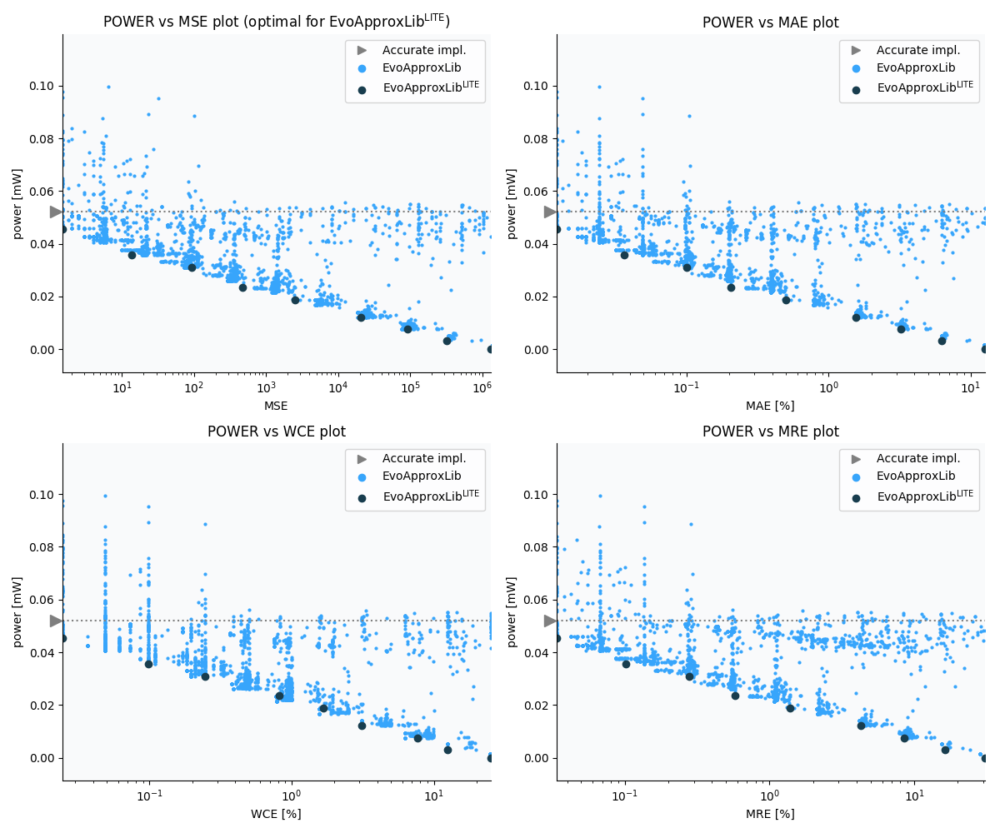

Selected circuits
===================
 - **Circuit**: 12-bit unsigned adders
 - **Selection criteria**: pareto optimal sub-set wrt. pwr and mse parameters

Parameters of selected circuits
----------------------------

| Circuit name | MAE% | WCE% | EP% | MRE% | MSE | Download |
| --- |  --- | --- | --- | --- | --- | --- | 
| add12u_574 | 0.00 | 0.00 | 0.00 | 0.00 | 0 |   [[VerilogPDK45](add12u_574_pdk45.v)] [[C](add12u_574.c)] |
| add12u_C66 | 0.012 | 0.024 | 75.00 | 0.034 | 1.5 |   [[VerilogPDK45](add12u_C66_pdk45.v)] [[C](add12u_C66.c)] |
| add12u_384 | 0.037 | 0.098 | 90.62 | 0.10 | 14 |   [[VerilogPDK45](add12u_384_pdk45.v)] [[C](add12u_384.c)] |
| add12u_3FD | 0.10 | 0.24 | 96.88 | 0.28 | 92 |  [[Veriloggeneric](add12u_3FD.v)]  [[C](add12u_3FD.c)] |
| add12u_024 | 0.21 | 0.82 | 97.84 | 0.58 | 474 |  [[Veriloggeneric](add12u_024.v)]  [[C](add12u_024.c)] |
| add12u_24A | 0.50 | 1.67 | 99.28 | 1.39 | 2518 |  [[Veriloggeneric](add12u_24A.v)]  [[C](add12u_24A.c)] |
| add12u_AB3 | 1.56 | 3.12 | 99.99 | 4.27 | 19387 |   [[VerilogPDK45](add12u_AB3_pdk45.v)] [[C](add12u_AB3.c)] |
| add12u_0A0 | 3.20 | 7.71 | 99.91 | 8.54 | 92047 |  [[Veriloggeneric](add12u_0A0.v)]  [[C](add12u_0A0.c)] |
| add12u_6C0 | 6.25 | 12.50 | 100.00 | 16.24 | 325756 |   [[VerilogPDK45](add12u_6C0_pdk45.v)] [[C](add12u_6C0.c)] |
| add12u_B42 | 12.50 | 25.00 | 100.00 | 30.62 | 13015.54e2 |  [[Veriloggeneric](add12u_B42.v)]  [[C](add12u_B42.c)] |
    
Parameters
--------------

References
--------------
   - V. Mrazek, Z. Vasicek and R. Hrbacek, "Role of circuit representation in evolutionary design of energy-efficient approximate circuits" in IET Computers & Digital Techniques, vol. 12, no. 4, pp. 139-149, 7 2018. doi: [10.1049/iet-cdt.2017.0188](https://dx.doi.org/10.1049/iet-cdt.2017.0188)

             